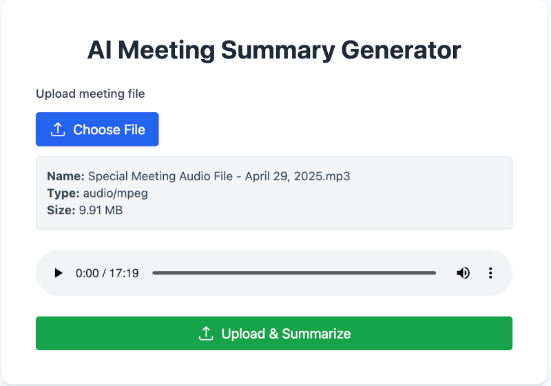

#  AI Meeting Summary Generator

AI Meeting Summary Generator is a full-stack web application that transcribes, summarizes, and organizes meetings using AI. It helps professionals convert long meetings into concise, structured summaries with key takeaways, action items, and timestamps — all powered by OpenAI and LangChain, and built with a modern React + Node.js stack.

This project demonstrates the practical application of large language models (LLMs) in workplace productivity, focusing on speech-to-text integration, summarization pipelines, and real-time feedback.#

---

## 🛠 Built With

---

## 🛠 How to Use

git clone https://github.com/spikepoolie/smart-meeting-summarizer.git

cd smart-meeting-summarizer

## Frontend

cd frontend

npm install

npm run start

## Backend

cd backend

npm install

node server.js

---

## Credentials Back end - .env

Create a .env file in the root of the backend folder and add this:

- AWS_ACCESS_KEY_ID=[replace with your key]
- AWS_SECRET_ACCESS_KEY=[replace with your key]
- AWS_REGION=[replace with your aws region]
- AWS_S3_BUCKET_NAME=[replace with your aws bucket name]
- OPENAI_API_KEY=[replace with your key]
- PINECONE_API_KEY=[replace with your key]
- PINECONE_INDEX_NAME=[replace with your index name]
- PINECONE_ENVIRONMENT=[replace with your environment]
- PINECONE_CONTROLLER_HOST_URL=[replace with your pinecone host url]

---

## Credentials Front end - .env

Create a .env file in the root of the frontend folder and add this:

- REACT_APP_API_URL=http://localhost:5008 (or any other port you are running your Express server)
- REACT_APP_ENV=development

---

## 🌟 Key Features

- 🎙 Upload audio or enter meeting transcript
- 📄 AI-generated summary with key points, decisions, and action items
- ⏱ Extract text from the video files to optimize and save resources before processing
- 🤖 GPT-3-turbo-powered summarization using LangChain
- 📥 Export summary to PDF or Markdown
- 🧽 Clean, responsive React components

---

## ⚙️ Tech Stack

| Layer         | Technology                 |
| ------------- | -------------------------- |
| Frontend      | React, Tailwind CSS        |
| Backend       | Node.js, Express           |
| AI Engine     | OpenAI API (`gpt-3-turbo`) |
| Orchestration | LangChain                  |
| AWS           | AWS Transcriber and S3     |
| HTTP Client   | Axios                      |
| Deployment    | Localhost / AWS EC2        |

---

## 🧠 How It Works

1. User uploads audio or pastes meeting transcript
2. The backend transcribes audio (if needed)
3. Sends the text to LangChain pipeline
4. Summarization uses a `ChatPromptTemplate` with OpenAI GPT
5. Receives structured response:
   - List key participants and their roles (if mentioned)
   - Group and summarize main issues or agenda items
   - Include votes, approvals, rejections, or consensus points
   - Who was involved, the topic of dispute, and how it was resolved (if resolved)
   - Include any quotes that reflect key moments or tones
   - List tasks assigned, responsible parties, and deadlines
   - Mention scheduled meetings or deadlines for future discussion
   - Briefly describe the tone (e.g., productive, tense, divided)

The result is formatted and shown in the UI, ready to export or copy.

---

## 🧪 Example Transcript Input

---

## 🧪 Example Summary Output

